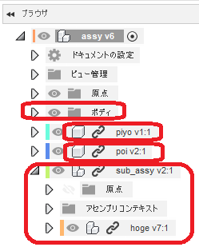
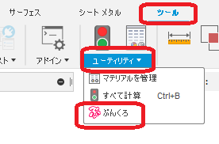
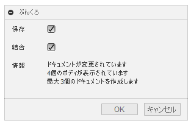
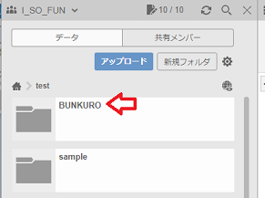

# **_Fusion360 BUNKURO_**

これは、オートデスクソフトウェア「Fusion360」のアドインです。

アクティブなドキュメントのルートコンポーネントに直接ぶら下がっているコンポーネント毎に
新たなドキュメントを作成し、ボディを複製（リンク無し）します。

Fusion360 日本語フォーラムの[こちら](https://forums.autodesk.com/t5/fusion-360-ri-ben-yu/da-gui-moasenburiwo-dongkasu-fang-fano-yitsutoshite/td-p/10123423)取り組みです。

※"BUNKURO" は、"コンポーネント毎に分割して複製を作成する" -> "分割して複製" -> "分割してクローン" -> "分クロ"　・・・苦しい。

---

## インストール :

インストールする際は、zip ファイルをダウンロード/展開後 "BUNKURO" フォルダをアドインとして登録してください。

アドインの登録は、[こちら](https://kantoku.hatenablog.com/entry/2021/02/15/161734)の手順に従ってください。

## 使用法 :

ルートコンポーネントに直接ぶら下がっているコンポーネント毎に新たなドキュメントを作成し、表示されているボディのみをコピペします。

上記の状態の場合、4 個のドキュメントが作成されます。

- アドインを起動。"ツール" タブの "ユーティリティ" パネル内にコマンドが追加されます。

  

- コマンドを実行。

- ダイアログが表示されます。各項目を設定して下さい。

  

  - 保存 : 作成された新たなドキュメントの保存を行います。

    - 保存先はアクティブなドキュメントの保存先内に "BUNKURO" と言うフォルダを作成し、その中にされます。

      

    - ファイル名は "ドキュメント名" \_ "コンポーネント名" となります。(ルートコンポーネントの場合は '\_root' となります。)
    - ファイル名として使用出来ない文字(コンポーネント名の ":" 等)は,
      "-" の文字に変換されます。※保存時のみです。
    - 保存を行わない場合は、作成されたドキュメント名に名前が付いていますが保存されていないので注意してください。

  - 結合 : 新たなドキュメント内の全てのボディの結合を試みます。

    - 可能な限りの結合を行いますが、必ず出来るわけでは有りません。

  - 情報 : アクティブなドキュメントの各種情報を表示します。
    - 1 度も保存されていない(データパネルに無い)場合、'ドキュメントが一度も保存されていません' と表示されます。
    - 修正し保存されていない場合、'ドキュメントが変更されています' と表示されます。
    - 'xx 個のボディが表示されています' と表示されます。0 個の場合は、OK ボタンは押せません。
    - '最大 xx 来のドキュメントが作成されます' と表示されます。

- OK ボタンを押すことで処理をスタートし、終了時に '終了' のダイアログが表示されます。

## 注意 ：

- 基本的に元のドキュメントは変更を行いませんが、処理の都合上ボディやコンポーネントの表示/非表示を頻繁に行います。その為、ファイル名のタブの横に変更を示すアスタリスク(\*)が付きますが、形状等には変更しておりません。

  

- 個人ライセンスの場合、'保存' にチェックを入れ実行しても "編集可能なドキュメントは 10 個まで" の制限を受け、保存されないドキュメントが出てくる可能性が有ります。その際は、他のドキュメントを "読み込み専用" に切り替えつつ手動で保存を行ってください。

  

- 一度も保存を行っていないドキュメントに対し "保存" をチェックすると OK ボタンが押せません。実行する際は "保存" のチェックを外してください。

## 問題 ：

- 処理終了後、実行時のドキュメントをアクティブにすると Fusion360 がクラッシュする為、機能を止めています。

- 上記の問題から、コンポーネントの移動で位置を確定していない場合、ダイアログが表示されたままになります。(処理は終了します。)

## アクション :

以下の環境で確認しています。

- Fusion360 Ver2.0.9849
- Windows10 64bit Pro , Home

## ライセンス :

MIT

## 謝辞 :

- [日本語フォーラム](https://forums.autodesk.com/t5/fusion-360-ri-ben-yu/bd-p/707)の皆さん、ありがとう。
